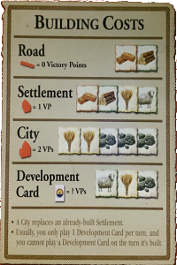

Settlers of Catan Version 1.0 by Bardia Parmoun

Released on: 30/05/2019

______________________________________________________________________________________

DESCRIPTION
______________________________________________________________________________________
This program is simulating the board game setters of catan. It has the option of 
multiplier and the ability to play with the computer. For multiplier run the 
"settlers_of_catan.t" and for the the option to play with the computer run the 
"settlers_of_catan (with ai).t" file. 

If you do not know how to play this board you can check out this link!
https://medium.com/board-game-brother/how-to-play-settlers-of-catan-e51c5a5aa499

INSTALLING UNDER WINDOWS 10
______________________________________________________________________________________
This program was created with the Turing language. All you need to run this game is 
to install the turing language:

You can install turing using this link:
https://turing.software.informer.com/4.1/
______________________________________________________________________________________
 
USAGE
______________________________________________________________________________________
First run the program. You should see the board. Click on the card icon \

After that you are taken to the menu where you will be able to select the different 
things you can build\

After you are done your turn click the next turn button so your opponent can 
finish theirs \

The first person to get to 10 victory points wins the game!
______________________________________________________________________________________

CREDITS
______________________________________________________________________________________
Author: Bardia Parmoun

______________________________________________________________________________________

LICENSE
______________________________________________________________________________________
MIT License

Copyright (c) [2019] [Bardia Parmoun]

Permission is hereby granted, free of charge, to any person obtaining a copy
of this software and associated documentation files (the "Software"), to deal
in the Software without restriction, including without limitation the rights
to use, copy, modify, merge, publish, distribute, sublicense, and/or sell
copies of the Software, and to permit persons to whom the Software is
furnished to do so, subject to the following conditions:

The above copyright notice and this permission notice shall be included in all
copies or substantial portions of the Software.

THE SOFTWARE IS PROVIDED "AS IS", WITHOUT WARRANTY OF ANY KIND, EXPRESS OR
IMPLIED, INCLUDING BUT NOT LIMITED TO THE WARRANTIES OF MERCHANTABILITY,
FITNESS FOR A PARTICULAR PURPOSE AND NONINFRINGEMENT. IN NO EVENT SHALL THE
AUTHORS OR COPYRIGHT HOLDERS BE LIABLE FOR ANY CLAIM, DAMAGES OR OTHER
LIABILITY, WHETHER IN AN ACTION OF CONTRACT, TORT OR OTHERWISE, ARISING FROM,
OUT OF OR IN CONNECTION WITH THE SOFTWARE OR THE USE OR OTHER DEALINGS IN THE
SOFTWARE.